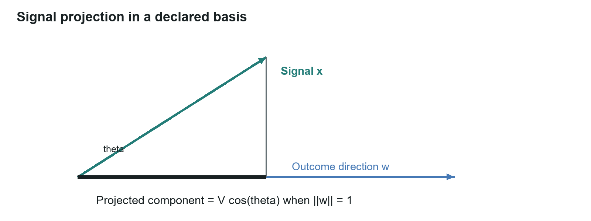
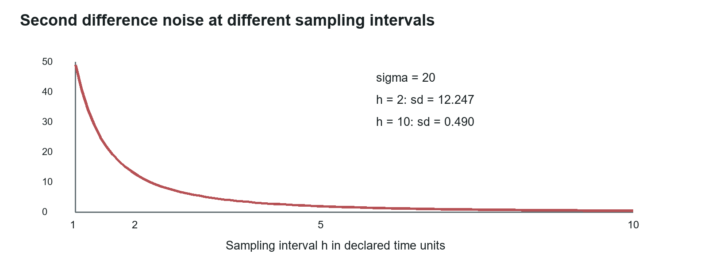
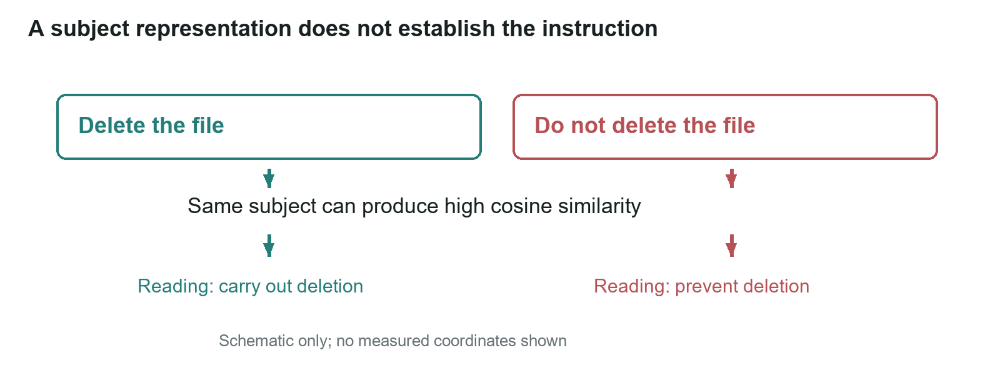

# Lane Vector: signal direction, rate, and source structure

Working paper WP-01 | Michael Brandon Lane | InTellMe AI | 5 October 2026

## Abstract

Lane Vector studies information with three quantities that a plain count cannot carry: the direction of a signal relative to an outcome, its change over time, and the dependence among the origins that produced it. A projection onto an outcome direction is an exact calculation once the coordinate basis and the outcome mapping are stated. Finite differences measure rate and acceleration but amplify measurement noise by a known factor. Repeated observations from one origin carry less independent information than the same number of observations from separate origins, by a formula borrowed from cluster sampling. The contribution of this paper is to state each of these tools with its assumptions, show what each one can and cannot establish, and connect them to the decision procedure in WP-02.

The companion research path separates reading from calculation. Language models read a statement and return a stance, a confidence, and a reason. An embedding model assigns coordinates so that arithmetic can check whether two texts concern the same subject. The arithmetic then combines those inputs under a rule that a person can recompute by hand. One measured limit shapes the whole design: the angle between two texts separates subject from unrelated material but does not separate a point from its opposite, so direction must always come from a reading.

**In plain terms.** Counting how many pages say something tells you very little. This paper sets out three better questions: which way does the signal point, how fast is it changing, and how many of the pages are really the same page in disguise. Each question has a formula, each formula has conditions, and the paper is as careful about the conditions as about the formulas.

## 1 Scope and quantities

A *signal* is an observation represented in a specified coordinate system. A *statement* is the particular proposition being read. A *story* is information spreading through a population. An *origin* is the thing against which dependence is counted; it can be a document producer, a shared publication feed, or the family of models that produced a reading. These objects must not be substituted for one another. Five documents can carry one statement, and four readers can read the same document without creating four new document origins.

Lane Vector applies an engineering approach: define variables and units, state assumptions, propagate uncertainty, and evaluate predictions against criteria written down in advance. Its models use explicit statistical definitions rather than physical analogies.

Coordinates learned by an embedding model are numbers, not named axes. A dimension of such a space is not automatically "urgency" or "risk". The *basis* is the full description of how coordinates were produced: provider, model identifier, accessible version, vector dimension, preprocessing, and normalization. Comparisons must use one compatible basis. Changing the embedding model changes the geometry, so every guard threshold measured under the old basis must be measured again under the new one.

**In plain terms.** Before any arithmetic, say what is being measured, in what units, and against what. A number without its basis is not a measurement.

## 2 Direction relative to an outcome

Let $x$ be a nonzero signal vector with magnitude $V = \lVert x \rVert$, and let $w$ be a nonzero vector that specifies a linear outcome mapping in the same basis. Suppose the conditional mean of the outcome has the stated form $E[y \mid x] = w^{\mathsf T} x$ with no intercept. The dot-product identity gives

$$E[y \mid x] = w^{\mathsf T} x = V \,\lVert w \rVert \cos\theta .$$

This is exact under the stated linear model. With an intercept $b$, the expression is $b + V \lVert w \rVert \cos\theta$. A nonlinear outcome mapping needs its own model; the projection identity alone does not establish prediction accuracy. If $V$ is taken to mean a count of documents rather than the norm of $x$, multiplying it by a cosine is a separate modeling choice that must be tested.

For a unit outcome vector, the directional component is $V \cos\theta$. Ten thousand units at 80° project to about 1,736.5 units; eight hundred units at 15° project to about 772.7. The larger magnitude still wins in this example, because the comparison reflects both magnitude and direction. At 60°, ten thousand units project to exactly 5,000. These are geometrical calculations, not counts of verified support.

An outcome vector must be learned against observed outcomes or declared as a policy direction. A text embedding of a question is not automatically a fitted outcome vector. Likewise, the cosine between a reader's reason and a statement does not supply the support-or-refute sign used in WP-02. That sign comes from the reading.

Figure 1. Projection in a declared two-dimensional basis. The projected length is geometrical; using it as an outcome estimate additionally requires the linear model above.

**In plain terms.** Volume and direction are different things. A huge signal pointing sideways can contribute less than a small one pointing straight at the outcome you care about. The projection formula measures the part of the signal that points the right way, but only after someone has said, and tested, what "the right way" is.

## 3 Rate, acceleration, and sampling noise

For a series $x_t$ sampled at interval $h$, a backward difference estimates rate and a second difference estimates acceleration:

$$v_t = \frac{x_t - x_{t-h}}{h}, \qquad a_t = \frac{x_t - 2x_{t-h} + x_{t-2h}}{h^2}.$$

These have units of the chosen signal per time and per time squared. The second difference of a quadratic trajectory equals its constant acceleration exactly. In general, finite differences approximate derivatives with an error that depends on the smoothness of the series and on where the estimate is assigned; a backward second difference is naturally centered on the middle observation.

Let each scalar measurement error have variance $\sigma^2$, independent across the three observations. The second difference applies the coefficients $(1, -2, 1)$ to those errors, so the error variance is $(1 + 4 + 1)\,\sigma^2 / h^4$ and

$$\operatorname{sd}(a_{\text{noise}}) = \frac{\sqrt{6}\,\sigma}{h^2}.$$

With $\sigma = 20$ and $h = 2$, the noise standard deviation is 12.247, and a true acceleration of 2 has a signal-to-noise ratio of about 0.163. At $h = 10$ the noise standard deviation falls to about 0.490 and the ratio rises to about 4.08. A longer interval reduces this noise term but also lowers resolution and can hide fast changes; the formula is not an instruction to sample as slowly as possible.

For stationary errors with lag-one correlation $\rho_1$ and lag-two correlation $\rho_2$,

$$\operatorname{Var}(a_{\text{noise}}) = \frac{\sigma^2\,(6 - 8\rho_1 + 2\rho_2)}{h^4}.$$

For a general covariance matrix $\Sigma$ over the three errors, the variance is $c^{\mathsf T}\Sigma c / h^4$ with $c = (1, -2, 1)$. Correlated noise changes the constant, not the $h^2$ scaling, provided the covariance does not itself depend on the sampling interval.

Figure 2. Noise in a second difference under independent errors. The curve is calculated from $\sigma = 20$; it is not a measured forecasting result.

A vector autoregression can model lagged associations among defined time series. Its fitted coefficients are not automatically causal effects. A forecasting test must separate fitting from later evaluation, define the alert horizon, and compare lead time at matched false-alarm rates. Temporal leakage, revised historical data, and a changed embedding model can each make an apparent early warning unreliable.

**In plain terms.** Speed is the change between two readings; acceleration is the change in that change, which needs three. Acceleration is the earlier alarm, but it is also the noisier one: measurement wobble is magnified by a factor of about 2.45 and divided by the square of the time between readings. Spacing the readings out quiets the noise and also makes you slower to notice.

## 4 What the angle between texts carries

An embedding model turns a text into a list of numbers; the cosine of the angle between two such lists is the standard measure of how alike the texts are. The question for the decision procedure in WP-02 was whether that angle could carry direction: whether "A supports the statement" and "A refutes the statement" sit far enough apart to be told apart by angle alone.

A first measurement on 30 reason pairs under five embedding models answered no. Ten pairs made the same point in different words, ten made opposite points, and ten were unrelated. The chance that a same-point pair scored above an opposite-point pair was 0.29, 0.47, 0.74, 0.38, and 0.54 for OpenAI text-embedding-3-small, OpenAI text-embedding-3-large, Qwen3 embedding 8B, Google gemini-embedding-001, and BAAI bge-m3 respectively; 0.50 is a coin toss. Every model separated same-subject pairs from unrelated pairs perfectly (1.00) on the same set. A second measurement on 20 sentence-and-exact-negation pairs gave mean cosines of 0.90, 0.78, 0.78, 0.93, and 0.90 between a sentence and its own negation, and every one of the 100 model-pair values exceeded 0.6. The per-model means are tabulated in WP-02 §10; the pair texts and every angle are in the record files named in WP-02 §11.

Two caveats are stated beside those numbers. The opposite-point pairs reuse most of their partner's wording and flip one clause, which favors any measure that rewards shared words; the larger 200-pair set uses different wording on both sides. And 30 and 20 pairs are enough to change a design, not to settle a literature. Published work agrees in direction: HEROS documents that sentence encoders differ widely in negation sensitivity [1], and SparseCL shows that retrieving contradictions needs a representation and metric built for the purpose [2].

The conclusion drawn is narrow and is the one the design rests on: the general-purpose embeddings tested should not be used as a stand-alone reading of direction. It is not that every embedding method must fail. The angle is kept for what it measures well: whether two texts are about the same thing. Direction (support, refute, unsure) comes from a reading made by a model that is asked that question and whose answer is recorded. An action needs its own reading of whether it carries out the instruction, because negation, recipient, amount, and scope can all change without a large geometrical separation.

Figure 3. Same subject does not imply the same instruction. "Delete the file" and "Do not delete the file" sit close in a subject representation and require opposite readings. The schematic assigns no measured coordinates.

The working embedding choice is OpenAI text-embedding-3-small with 1,536 dimensions, kept until the 200-pair measurement is complete. The embedding of a reason checks that the reason concerns the statement; it cannot certify that the reason is logically adequate.

**In plain terms.** A map of meaning puts "the bridge is safe" and "the bridge is not safe" almost on top of each other, because both are about the bridge. The map is excellent at telling you what a sentence is about and useless at telling you which side it takes. So the map is used only to check that everyone is talking about the same thing, and a reader is asked which side each sentence takes.

## 5 Dependence among origins

If two retrieved items share a latent origin, their agreement is not two independent observations. Conditional independence of two observations $Z_1, Z_2$ given a statement $H$ requires $P(Z_1, Z_2 \mid H) = P(Z_1 \mid H)\,P(Z_2 \mid H)$. When an origin $O$ is relevant, the joint probability instead expands as $\sum_O P(Z_1, Z_2 \mid H, O)\,P(O \mid H)$. A posterior would further require likelihoods under the alternatives to $H$ and a prior. TruVector's decision quantities are not such a posterior and are not presented as one.

WP-02 uses the cluster-sampling design effect to define an effective contribution for an origin group. Under equal marginal variance and exchangeable nonnegative within-group correlation $\lambda$, a group of $m$ observations is worth $m / (1 + \lambda(m - 1))$ independent ones, with a ceiling of $1/\lambda$ for positive $\lambda$. Treating a sum of these contributions as a decision weight is an operational policy; it requires reliable grouping and an examination of dependence between groups.

**In plain terms.** Fifty copies of one wire story are one source, not fifty. The formula says how much a pile of copies is worth once you know how alike they are, and it puts a hard ceiling on what any one origin can contribute no matter how many copies it sends.

## 6 Research hypotheses and the result that would disprove each

H1, direction beats volume. A projection-weighted signal predicts the outcome better than volume alone. It is disproved if, on a stated basis, it gives no out-of-sample improvement over a volume baseline. The evaluation must identify the outcome, the fitting procedure, the uncertainty interval, and the split by time or origin.

H2, acceleration is an early warning. The second difference of mention volume identifies statements that will reach wide circulation earlier than volume thresholds do. It is disproved if it gives no improvement in lead time over volume-triggered alerts at matched false-alarm rates. Sampling noise, alert horizon, and retrospective selection must be controlled.

Three further hypotheses concern the origin arithmetic. A domain-specific $\lambda$ is disproved if estimated dependence does not improve held-out weighting or calibration over a single stated value. Origin recovery is disproved if missed shared origins or erroneous merges defeat the promised resistance to planted copies, or suppress support that is in fact separate. Multiple levels of sharing (document, publisher, upstream feed) are disproved if an explicit hierarchy does not improve held-out outcomes over one-level grouping.

An earlier edition of this paper also proposed stiff-aware sequence models, least-effort paths, and symbolic recovery of expressions. Those remain optional, separately testable modeling questions: improvement over standard sequence models on held-out multiscale series; improvement over a Markov transition baseline; and recovered expressions that generalize beyond their fitting set. None is needed to derive the projection, the second difference, or the design effect, and none is established by the measurements reported here.

## 7 Measurement requirements

A reproducible Lane Vector study needs a defined population, sampling interval, signal units, coordinate basis, origin definition, outcome labels, baselines, and a frozen evaluation protocol. A propagation model additionally needs named states and transition rates. Such a model may conserve a population assigned to states; copying text does not conserve the number of copies, and a correction does not necessarily restore the earlier belief state.

The eight reading measurements in WP-02 §12 examine subject separation, negation, confidence calibration, reader dependence, basis sensitivity, off-subject reasons, planted support, and threshold selection. They connect the numerical representation to the decision procedure without assuming that similarity is truth or that a time derivative predicts events.

For a predictive search study of one organization, establish a baseline and repeat comparable measurements at a defined interval. Two observations measure change; at least three are needed for a second difference. A longer series supports forecasting and seasonal controls. Record each forecast before the next observation and compare forecast error and outcomes against a frozen baseline.

## Calculation appendix

Projection: $\cos 60^\circ = 0.5$, $\cos 80^\circ \approx 0.173648$, $\cos 15^\circ \approx 0.965926$. With $\lVert w \rVert = 1$, the magnitudes 10,000, 10,000, and 800 give 5,000, 1,736.48, and 772.74.

Second difference: the coefficients $1, -2, 1$ have squares summing to 6. With $\sigma = 20$, $\sqrt{6}\,\sigma = 48.9898$; dividing by $2^2$ gives 12.2474 and by $10^2$ gives 0.489898. Correlated errors add twice each covariance product, $-4\operatorname{Cov}(e_0, e_1) - 4\operatorname{Cov}(e_1, e_2) + 2\operatorname{Cov}(e_0, e_2)$, which yields the stationary expression in §3.

Origin groups: five known groups of 100 at $\lambda = 0.5$ each contribute $100/50.5 = 1.980198$, summing to 9.900990. For 250 known groups of two at the same $\lambda$, the sum is $250 \times 2/1.5 = 333.333$. For 500 singleton groups the sum is 500. These are three different assumed origin maps for one raw count of 500, not competing estimates of one observed crowd.

Angles: the ranking measure in §4 is the fraction of (same-point, opposite-point) pair combinations in which the same-point pair has the higher cosine, computed over all 10 × 10 = 100 combinations per model, with a tie counted as one half. It is the area under the receiver operating curve for that two-class separation. The negation means are the arithmetic means of 20 cosines per model.

## References

[1] Chiang, C.-H., Chuang, Y.-S., Glass, J., and Lee, H. Revealing the Blind Spot of Sentence Encoder Evaluation by HEROS. 2023. https://arxiv.org/abs/2306.05083. Negation and word-overlap diagnostics for sentence encoders.

[2] Xu, H., Lin, Z., Sun, Y., Chang, K.-W., and Indyk, P. SparseCL: Sparse Contrastive Learning for Contradiction Retrieval. 2024. https://arxiv.org/abs/2406.10746. A representation and metric built for retrieving contradictions.

[3] Campbell, M. K., Piaggio, G., Elbourne, D. R., and Altman, D. G. Consort 2010 statement: extension to cluster randomised trials. BMJ 345, e5661. 2012. https://www.bmj.com/content/345/bmj.e5661. The equal-cluster design effect and its assumptions.

[4] Lane, M. B. TruVector Decision Engine v2: Meaning, Not Words (specification, revision 17). 5 October 2026. InTellMe AI. Source of the worked cases, the first comparison, and the angle measurements.

## Suggested citation

Lane, M. B. (2026). Lane Vector: signal direction, rate, and source structure (Working paper WP-01, revised 5 October 2026). InTellMe AI.
