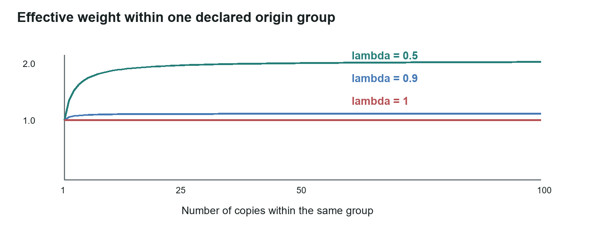
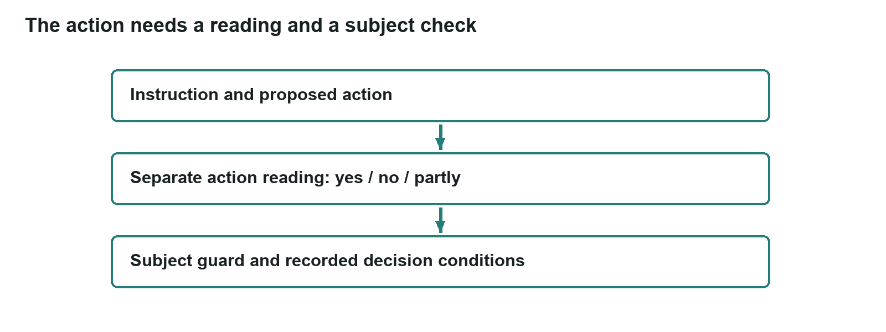
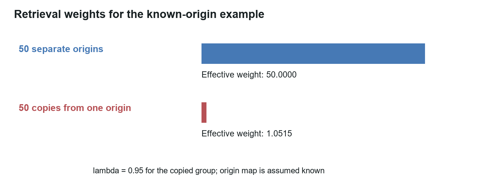
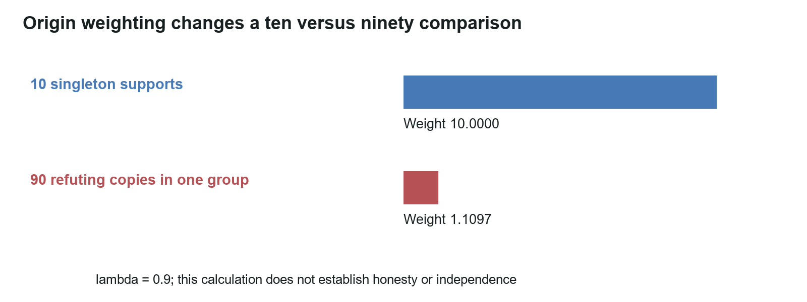
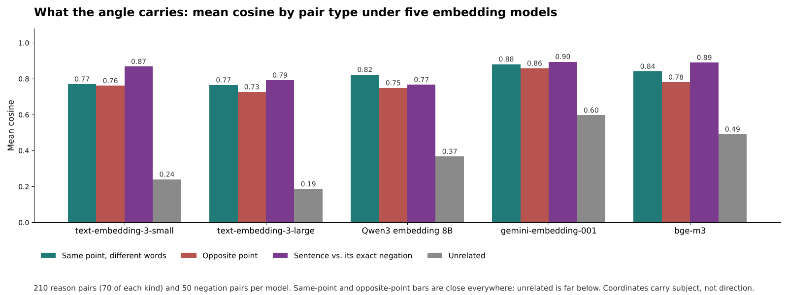

# TruVector: source dependence and decisions from model readings

Working paper WP-02 | Michael Brandon Lane | InTellMe AI | 11 October 2026

## Abstract

TruVector is a checkpoint between retrieved material and an AI action. Its decision procedure separates reading from arithmetic. Readers (language models) supply a stance, a confidence, and a reason for a statement, and separately read whether a proposed action carries out its instruction. Arithmetic discounts repeated origins, forms support, refute, and unsure shares, and returns Allow, Review, or Block with a record from which every number can be recomputed. Embedding similarity serves as a subject guard, not as a test of agreement or a grant of permission.

The procedure replaces a word-count gate that never used the readers' stances. On a first comparison of 60 statements read by four pinned readers, the word-count gate was right on 14 and the reading-based rule on 58. That set is balanced and easy, and it carries no actions, so the result is a reason to continue, not an estimate of accuracy in use. The decision output is a policy result, not a probability that a statement is true. The open research questions are whether the readings, the origin grouping, the confidence correction, and the guard thresholds improve decisions on held-out material; each is stated below with the observation that would disprove it.

**In plain terms.** Before an AI system acts on something it read, TruVector asks several different models what they make of it, counts their answers in a way that refuses to be fooled by copies, checks that they were all talking about the same thing, and asks separately whether the planned action is what was requested. The sum is written down so a person can check it.

## 1 The problem

Five copies of one statement do not supply five independent confirmations. Nor do different words necessarily mean different conclusions. A useful checkpoint must read support and refutation, keep uncertainty visible, discount shared origins, and check the particular action. Repetition alone must never convert weak support into permission.

An arithmetic layer that is separate from the readers makes each decision reconstructable from reader outputs, origin assignments, weights, and thresholds. Reader accuracy, origin grouping, and confidence calibration can then be evaluated as distinct components, which is what makes targeted improvement and controlled comparison possible.

There are three reasons to keep the arithmetic outside the models rather than simply asking a model to decide. Ten runs of one model are one origin, so a decision that is only a model has one source however often it asks. The reader is what an attacker aims at, so the counting has to live where the attacker cannot reach it. And a formula can be audited, re-run by hand, and argued with in review; a confidence that a model felt cannot.

## 2 Conditional dependence and likelihood structure

Let $H$ be a statement and $Z_1, Z_2$ two retrieved observations. Factorization is valid only under conditional independence:

$$P(Z_1, Z_2 \mid H) = P(Z_1 \mid H)\,P(Z_2 \mid H).$$

If a shared origin $O$ explains their association, the correct expansion is

$$P(Z_1, Z_2 \mid H) = \sum_{O} P(Z_1, Z_2 \mid H, O)\,P(O \mid H).$$

Conditional independence within each value of $O$ does not in general restore independence once $O$ is summed out. Distinct URLs, accounts, providers, or model families are useful grouping signals, but they do not prove statistical independence. A full posterior would need an explicit likelihood model, alternatives to $H$, and priors. The rule below is deliberately a decision policy rather than an implicit posterior.

**In plain terms.** If two reports came from the same place, hearing both is not twice the information. The arithmetic has to know where things came from before it can count them.

## 3 Effective contribution of one origin

For $m$ observations of equal variance $\sigma^2$ with exchangeable pairwise correlation $\lambda$, the variance of their mean is $\sigma^2 (1 + \lambda(m - 1)) / m$. Equating this to the variance of a mean of independent observations gives

$$n_{\text{eff}}(m, \lambda) = \frac{m}{1 + \lambda(m - 1)}.$$

TruVector uses the nonnegative range $0 \le \lambda \le 1$. At $\lambda = 0$ the formula returns $m$; at $\lambda = 1$ it returns 1. For positive $\lambda$ it approaches $1/\lambda$ as $m$ grows. Its derivative with respect to $m$ is $(1 - \lambda) / (1 + \lambda(m - 1))^2$, so each additional copy adds a smaller increment than the last. $\lambda$ is a correlation for a defined variable and population, measured, not chosen; it is not a cosine similarity and not a synonym for "coordination".

For origin groups $g$, the policy total is $E_{\text{origin}} = \sum_g n_{\text{eff}}(m_g, \lambda_g)$, and each reply $i$ in group $g$ carries the base weight $b_i = n_{\text{eff}}(m_g, \lambda_g) / m_g$. These are effective weight units, not a discovered number of real operators. Summing them assumes sufficient separation between groups; it is not automatically the exact effective sample size of an arbitrary weighted estimator.

The working values are $\lambda = 0.9$ within one reader family on one prompt and 0 across families, and $\lambda = 0.95$ within one document origin. They are declared assumptions until research direction R4 measures them. A family boundary does not eliminate shared training data, tools, retrieved documents, or prompts. Exact duplicated replies should additionally be tested at $\lambda = 1$. A family-independent baseline is needed to show whether the discount helps.

Figure 1. Effective weight within one origin group as copies are added, for three declared values of $\lambda$. Recovering origins and estimating $\lambda$ are separate tasks.

### Retrieved origins and reader origins

Document grouping and reader grouping are two distinct layers. Four families reading one syndicated document remain four readings of one document origin. Retrieved grouping should use content hashes, document identity, original publication, byline, upstream feed, timestamps, and shared-copy indicators. Reader grouping should record family, exact model, prompt, provider route, and repeated-run identity. Uncertain group assignments need sensitivity checks rather than a silent assumption of separation.

The ceiling protects against repetition within a correctly recovered group. Splitting one copying campaign into ten false groups raises the summed contribution; a formula evaluated on the wrong groups cannot recover the missing relationship. Hierarchical sharing is therefore a measurement problem, not a reason to multiply several discounts without deriving the resulting weight.

**In plain terms.** Fifty copies at $\lambda = 0.95$ are worth about 1.05 sources, and no number of copies from that origin can be worth more than 1.05. The protection is only as good as the map of who copied whom.

## 4 The word-count method being replaced

The frozen method requests stance, confidence, and reason from $N$ readers and requires $K$ valid replies; below quorum it returns Block. Let $W_i$ be the word set of reply $i$, $J$ the mean pairwise Jaccard overlap of those sets, $M$ the number of occurrences of nine marker words, and $T$ the total number of words:

$$J = \operatorname{mean}_{i<j} \frac{|W_i \cap W_j|}{|W_i \cup W_j|}, \qquad \delta = \min\!\left(\frac{10M}{T}, 1\right), \qquad p_0 = \operatorname{clamp}(J - \delta,\, 0,\, 1).$$

The nine markers are *however, but, contradict, disagree, incorrect, wrong, false, not true,* and *inaccurate*. Allow begins at $p_0 \ge 0.75$, Review at 0.45, and Block is below 0.45. Exact tokenization, phrase matching, empty-set behavior, and case handling belong to the frozen implementation record; the equations alone cannot reconstruct them.

The method also reports $p_1 = 0.5S + 0.3C + 0.2(1 - \delta)$ from confidence-weighted stance shares, and the specification confirms that $p_1$ never drives the gate. Unanimous refutation without marker words gives $p_1 = 0.50$, as does unanimous uncertainty; $p_1$ is telemetry, not a correctness probability.

Three paraphrased supportive reasons with $J = 0.15$ and $\delta = 0.08$ give $p_0 = 0.07$ and Block. Three literal copies with $J = 1$ and no markers give Allow. The phrase "not false" raises marker density while supporting the statement. The replacement therefore uses the stances the readers already supplied, plus a separate action reading, instead of treating word overlap or marker occurrence as meaning.

**In plain terms.** The old gate measured how many words the readers shared, not what they meant. Three readers agreeing in their own words looked like disagreement; three copies of one answer looked like unanimous agreement.

## 5 Readings and coordinates

Each stance request asks only whether a statement is supported, refuted, or unsure in the supplied context. It returns a stance, a raw confidence, and a reason, and it distinguishes support found in the retrieved material from an answer drawn from the model's own knowledge. An action request separately asks whether the proposed action carries out the instruction, returning yes, no, or partly, with a confidence and a reason. Instruction-following is a different question from whether an action is safe or authorized in the application.

One pinned embedding model maps the statement, each reason, the instruction, and the action to vectors. Cosine similarity is $x \cdot y / (\lVert x \rVert\,\lVert y \rVert)$. Missing, nonfinite, zero-length, or incompatible vectors produce no usable similarity. Within one record, all comparisons use one basis; a fallback to another embedding model requires re-embedding every compared text and recording the change.

For reply $i$, let $f_i$ be the recorded correction of its raw confidence (the identity until research direction R3 fits one) and $t_i$ a subject factor: 0.25 if the cosine between the reader's reason and the statement is below 0.4, and 1 otherwise. The decision weight is

$$w_i = b_i\, f_i\, t_i, \qquad W = \sum_i w_i .$$

If $W > 0$, the support, refute, and unsure shares $S$, $R$, $U$ are the sums of these weights for each stance divided by $W$; they sum to one. At $W = 0$ the shares and the entropy are undefined, and a zero-weight set with a valid quorum is routed to Review.

The mean pairwise cosine between the readers' reasons, $G_{\text{reason}}$, guards whether the reasons concern the same subject. Its starting threshold is 0.6. It does not show that the readers agree on *why*: a reason for support and a reason for refutation can concern the same subject. Logical adequacy of a reason requires a separate reading and its own evaluation.

**In plain terms.** Each reader says which side it takes, how sure it is, and why. The arithmetic keeps those three things apart. The "why" is checked only for being on topic; whether it is a good reason is a separate question the arithmetic does not pretend to answer.

## 6 Direction and certainty

Direction and certainty are kept as two separate numbers:

$$D = S - R, \qquad C = 1 - \frac{H(S, R, U)}{\ln 3}, \quad H = -(S \ln S + R \ln R + U \ln U),$$

with the convention $0 \ln 0 = 0$. $D$ lies between $-1$ and $1$; $C$ lies between 0 and 1 and measures how concentrated the readings are on one of the three labels. All support gives $D = 1$, $C = 1$; all refute gives $D = -1$, $C = 1$; all unsure gives $D = 0$, $C = 1$; equal thirds give $D = 0$, $C = 0$. Unanimous uncertainty is therefore concentrated uncertainty, not a reliable answer, and the rule treats it as such.

Normalizing removes any common confidence magnitude. Four supporting replies at confidence 0.1 produce the same $S$, $D$, and $C$ as four at confidence 0.9. Absolute confidence and total usable weight are separate evaluation dimensions. $C$ is reported as label concentration; it is not a calibrated probability of being right.

**In plain terms.** Direction is which way the readers lean, from fully against to fully for. Certainty is how much they agree with each other. Both are needed: readers can lean nowhere and agree completely, which is a clear "we do not know", and that is handed to a person rather than mistaken for a yes.

## 7 The action reading and the decision rule

Let $A_{\text{yes}}$, $A_{\text{no}}$, and $A_{\text{partly}}$ be the weighted shares of valid action readings, formed with the same documented origin and confidence weights; the stance-specific subject factor is not reused for the action question. Let $G_{\text{action}}$ be the cosine between the instruction and the proposed action, with a starting subject threshold of 0.7. A high $G_{\text{action}}$ is never sufficient on its own, because an action can reverse the instruction or change a critical field without moving far in the subject space.

Figure 2. An action check combines an explicit reading with a subject guard. A high similarity cannot override a reading that the action does not carry out the instruction.

The rule is evaluated in this order. Fewer than $K$ valid stance replies gives Block with a quorum reason. With a valid quorum: Block if $A_{\text{no}} \ge 0.5$, or if $D \le -0.5$ and $C \ge 0.5$. Otherwise Allow only if $D \ge 0.5$, $C \ge 0.5$, $E_{\text{origin}} \ge 2$, $G_{\text{reason}} \ge 0.6$, no unsupported-reader flag is set, $G_{\text{action}} \ge 0.7$, and $A_{\text{yes}} \ge 0.5$. Every other outcome is Review, with each failed condition listed in the record.

These thresholds are starting values that define the reference policy; research direction R8 refits them on development data and tests the frozen result on held-out material. Allow additionally requires $K$ valid action replies; a missing instruction or action, an invalid action denominator, or an unavailable guard prevents Allow. Application permissions and safety constraints are checked separately from this rule.

In a statement-only measurement there is no action to permit. Such a measurement reports the stance-derived Allow, Review, or Block category with the action checks marked not applicable, and that category must not be presented as permission to execute. The 60-statement comparison in §10 is of this kind and cannot measure the action rule.

**In plain terms.** Block when the readers say the action is not what was asked, or when they clearly and confidently refute the statement. Allow only when they clearly and confidently support it, at least two independent origins did so, they were talking about the same thing, nobody asserted without support, and the action is both about the instruction and confirmed to carry it out. Everything else goes to a person, with the reasons listed.

## 8 Support in retrieved material

When retrieved material is supplied, readers identify which passages support or refute the statement and separate their own knowledge from those passages. Documents are counted by their origins before document support is summarized. The unsupported-reader flag means a reader supports the statement without support in the available, independently grouped material; it does not mean the statement is false.

The flag is reported separately from $C$ and vetoes Allow. That keeps the concentration measure clean; any additional numerical penalty would be a versioned policy extension evaluated on its own.

Figure 3. Fifty separate singleton document origins and fifty copies from one known origin at $\lambda = 0.95$ contribute 50 and 1.0515. Their normalized shares are about 97.94 and 2.06 percent. These are weights, not a measured percentage of safe text and not a guarantee that a model will ignore the repeated content.

A retrieval gateway can use the weights to select or annotate material. That requires a concrete policy for representative passages, contradictory passages, ordering, and the context actually delivered. A fractional contribution is not a fractional document automatically removed by a formula. Discounting a copied document does not neutralize instructions embedded in it; resistance to prompt injection and source authenticity need separate evaluation.

## 9 Worked comparisons

These cases are analytical examples with declared inputs; they do not substitute for stored reader replies. Quorum is satisfied, action readings are yes, subject guards pass, and the unsupported-reader flag is absent unless noted. Confidence is 0.9 for every reader. Groups are reader families; two readers in one family are discounted at $\lambda = 0.9$.

| Case | Declared readings and groups | $p_0$ | Old result | $E_{\text{origin}}$ | $D$ | $C$ | Revised result |
| --- | --- | --- | --- | --- | --- | --- | --- |
| A | Three refute, groups of 2 and 1; $J$ 0.15, $\delta$ 0.50 | 0.00 | Block | 2.0526 | −1.0000 | 1.0000 | Block |
| B | Three support, groups of 2 and 1; $J$ 0.15, $\delta$ 0.08 | 0.07 | Block | 2.0526 | 1.0000 | 1.0000 | Allow |
| C | Three copied support replies, one family; $J$ 1, no markers | 1.00 | Allow | 1.0714 | 1.0000 | 1.0000 | Review |
| D | Three refute, groups of 2 and 1; $J$ 0.15, no markers | 0.15 | Block | 2.0526 | −1.0000 | 1.0000 | Block |
| E | Two support, one refute; three families; $J$ 0.15, $\delta$ 0.08 | 0.07 | Block | 3.0000 | 0.3333 | 0.4206 | Review |
| F | Two support in one family, one refute in another | — | — | 2.0526 | 0.0256 | 0.3694 | Review |

Case F specifies the revised calculation only; an old-gate score would additionally need word-overlap and marker inputs.

Marker trap: three supportive 40-word replies with $J = 0.15$ and exactly one occurrence of "false", inside the phrase "not false", have $\delta = 10/120 = 0.0833$ and $p_0 = 0.0667$, which is Block under the old gate. The revised result is Allow if the readers are grouped 2 and 1 and all other conditions pass.

Two further cases show the guards at work. Three supports with $G_{\text{reason}} = 0.3$ produce Review despite $D = C = 1$; that is an off-subject concern, not a demonstrated disagreement. A supported statement paired with an action at cosine 0.26 produces Review unless the action readings already require Block; conversely, an action at cosine 0.9 with a weighted no-share of 0.6 produces Block.

Figure 4. Ten singleton supporting origins against 90 refuting replies in one correctly identified origin at $\lambda = 0.9$: weights 10 and 1.1097. The directional weight favors the singleton side. Arithmetic alone does not establish that those ten are honest or independent.

**In plain terms.** Case B is the one that matters most: three readers who agree in their own words used to be blocked and are now allowed. Case C is the mirror: three copies of one answer used to sail through and are now held, because one origin cannot count as two.

## 10 First comparison and angle measurements

The first comparison used 60 statements drafted from public records: 20 labeled true, 20 labeled false, and 20 labeled unsettled. Four pinned readers returned 239 valid replies from 240 requests, and every statement reached quorum. Both scorings ran on the same stored replies, so the difference is the scoring alone.

| Group (20 each) | Old gate: allowed / held / blocked | Revised rule: allowed / held / blocked |
| --- | --- | --- |
| True | 0 / 5 / 15 | 20 / 0 / 0 |
| False | 0 / 6 / 14 | 0 / 0 / 20 |
| Unsettled | 0 / 0 / 20 | 0 / 18 / 2 |

The old gate was right on 14 of 60: it allowed none of the true statements, held or blocked all of them, and blocked every unsettled one. The revised rule was right on 58 of 60. The two misses are unsettled statements that the rule blocked because the readers refuted them. Both state an unproven result as proven, and a reader that reads them as worded is right to refute them; the question is a labeling one, and the labeling rule for later sets is to label the statement as worded rather than its broader subject. The total is reported as 58 of 60 under the original labels, and any relabeling after seeing the predictions is recorded separately. Re-scoring the same 60 under the v2.1 rule left every decision unchanged, because the v2.1 changes concern action checks and the naming of the reasons guard, and these statements carry no actions.

This set is easy by design. The harder groups (numbers, recent events, contested statements, negations) make up a 300-statement set in which every label is backed by an exact quote from a public source and no model labelled anything. On the same stored replies of that set, meaning-based scoring (the reading-based rule) made the right decision on 282 of 300 statements against 101 of 300 for word-overlap scoring (the word-count gate), exact McNemar p = 1.1e-50; neither gave Allow to any of the 180 refuted or unsettled statements, and a sentence and its exact negation received opposite decisions in 50 of 50 pairs against 0 of 50. The full tables are in WP-04; the set was built by the same team and carries no actions, so the result describes that set.

Two angle measurements were made under five embedding models. The first used 30 reason pairs and 20 negation pairs; its opposite-point pairs reused most of their partner's words. The second, larger set removed that advantage: 210 reason pairs (70 same point, 70 opposite point, 70 unrelated, no two on the same subject), with at least 40 opposite-point pairs written as opposite meanings in different words and at least 20 same-point pairs sharing almost no words, and 50 negation pairs with the true sentence first in exactly half.

| Embedding model | Same point | Opposite point | Unrelated | Same above opposite | Same subject above unrelated | Sentence vs. its negation |
| --- | --- | --- | --- | --- | --- | --- |
| OpenAI text-embedding-3-small | 0.770 | 0.761 | 0.240 | 0.465 | 1.000 | 0.868 |
| OpenAI text-embedding-3-large | 0.765 | 0.727 | 0.186 | 0.528 | 1.000 | 0.792 |
| Qwen3 embedding 8B | 0.823 | 0.749 | 0.367 | 0.618 | 0.999 | 0.767 |
| Google gemini-embedding-001 | 0.881 | 0.858 | 0.597 | 0.658 | 1.000 | 0.895 |
| BAAI bge-m3 | 0.841 | 0.781 | 0.491 | 0.692 | 0.997 | 0.890 |
| Word overlap (Jaccard), same pairs | 0.267 | 0.505 | 0.052 | 0.294 | 0.977 | — |

The first three columns of numbers are mean cosines on the larger set; "Same above opposite" and "Same subject above unrelated" are the chance that a pair of the first kind scores above a pair of the second (0.50 is a coin toss); the last column is the mean cosine between a sentence and its exact negation over 50 pairs. All 250 negation values exceeded 0.6, and 5, 0, 0, 21, and 17 of the 50 exceeded 0.9 for the five models in order. The first, smaller set gave the same picture: same above opposite 0.29, 0.47, 0.74, 0.38, and 0.54, perfect same-subject separation, and negation means of 0.90, 0.78, 0.78, 0.93, and 0.90.

Every embedding model separates same-subject from unrelated pairs, and does so better than word overlap; that is the job the design gives the angle, and research direction R1 passes on it. No model separates a point from its opposite well enough to use; the best, bge-m3 at 0.69, would still misorder about three pairs in ten. Word overlap does worse than chance at that task (0.29), because opposite-point pairs share more words than same-point pairs, which is the same failure that sank the old gate. The embedding choice therefore stays OpenAI text-embedding-3-small, and direction stays with the readers.

Figure 5. Mean cosine by pair type under the five embedding models on the larger set (210 reason pairs, 50 negation pairs). The same-point and opposite-point bars are close for every model while the unrelated bar is far below; a sentence and its exact negation are as close as, or closer than, two sentences making the same point.

**In plain terms.** On the first sixty statements the old gate got 14 right and the new rule got 58. The sixty were easy; on three hundred harder statements, each with a label backed by a quote from a public source, the old gate got 101 right and the new rule got 282 (WP-04). The larger angle test settled the other question: the map of meaning reliably tells what a sentence is about, and still cannot tell which side it takes.

## 11 Study configuration and reproducibility

The pinned readers are openai/gpt-5.4-mini, anthropic/claude-haiku-4.5, google/gemini-2.5-flash, and deepseek/deepseek-v3.2, with $N = 4$, $K = 3$, and temperature 0. The stance prompt version is stance-only-2026-10-05; the action prompt version is action-check-2026-10-05. Full prompt text, model revision where available, routing, retries, and raw replies accompany any reproduction. A fallback model changes the reader set and is disclosed.

The working basis is OpenAI text-embedding-3-small, 1,536 dimensions. A record includes all compared vectors or a stable archived reference, normalization, raw and corrected confidences, group assignment, $\lambda$ and its status (declared or measured), weights, $S$, $R$, $U$, $D$, $C$, subject scores, action readings, flags, quorum, thresholds, and every reason for the decision. Temperature 0 alone does not guarantee identical outputs across provider revisions or routes.

The record files for §10 are the 60 statements with their labels, the 239 reader replies, the per-statement results under both scorings, both sets of reason and negation pairs, and the per-pair cosines under every model. The old and revised scorings ran on the identical stored replies, which isolates the scoring change. The move from the earlier combined statement-and-action prompt to the stance-only prompt is a second intervention and is compared in a separate controlled arm. Comparisons report per-category errors and Review rates, not accuracy alone.

## 12 Eight research directions, each with the result that would disprove it

R1, subject guard. Compare at least three embedding models from two providers on same-point, opposite-point, and unrelated pairs, controlling word overlap. Disproved as a basis for the guard if the best model separates same-subject from unrelated no better than word overlap on held-out pairs. Answered on the 210-pair set: every model separates same-subject from unrelated pairs (0.997 to 1.000) better than word overlap (0.977), so the guard stands; none separates a point from its opposite (0.47 to 0.69), so direction is not taken from the angle.

R2, negation. Compare reader classifications with a cosine-threshold baseline on the same negation pairs. Disproved, as a reason to rely on reading, if the readers are no more accurate than a threshold on the angle. The angle half is answered: on 50 balanced pairs every model places a sentence and its negation above 0.6, so no threshold on the angle can tell which is true. The reader half is reported in WP-04: on the 50 negation pairs of the 300-statement set, scoring by the readers' stances gave Allow to the true sentence and Block to the false one in all 50, against 0 of 50 opposite decisions under word overlap. The set includes double negation, modal verbs, quantifiers, changed entities, numerical conditions, and instruction reversals, and is sized and frozen before evaluation. Specialized entailment and contradiction methods are additional baselines.

R3, confidence correction. Fit each reader's correction on development data; evaluate Brier score and reliability on held-out items. Disproved if the correction does not improve the prespecified score over label-only weights, in which case confidence is treated as noise and the rule uses labels alone. A scalar confidence in the chosen label supports a binary correctness Brier score; a three-class score would need a full probability vector, which the reply schema does not provide.

R4, reader dependence. Measure repeated-reader correlations within families and across families on a defined response or error variable, accounting for item difficulty. Disproved as a grouping if within-family dependence is not higher than across-family dependence, or if the grouped policy does not improve held-out decisions; then every reply is its own origin.

R5, basis sensitivity. Re-score frozen readings under two embedding bases and count decision flips. More than five percent flips defeats the stability criterion and calls for basis-specific guard calibration. Which decisions flip, and whether they improve or worsen errors, is reported; stability alone is not correctness.

R6, off-subject reasons. Test whether the reason guard distinguishes deliberately off-subject readings from ordinary readings and improves held-out decisions beyond labels alone. Disproved if the guard fires no more often on the off-subject set, or produces no prespecified decision improvement. Logical quality is a separate test from subject relevance.

R7, planted copies. Add dependent documents from controlled origins, including paraphrases and disguised origins. The within-origin bound fails if a correctly counted controlled origin ever exceeds $1/\lambda$; that arithmetic condition alone is not a security test. The complete method fails if false Allow rates rise beyond the prespecified tolerance or if origin errors defeat repetition resistance. Legitimate separate support and contradictory passages must be preserved. Planting at ten, thirty, and fifty percent of the retrieved material tests the pipeline, not merely the formula.

R8, decision thresholds. Fit thresholds only on development data and freeze them; compare on held-out material against an unweighted reader majority, the starting thresholds, and plain retrieval deduplication. Disproved as a rule if it does not outperform the majority baseline under the selected error criterion. False Allow, false Block, Review, action-error, and subgroup rates are reported with uncertainty, and a further untouched holdout is reserved if development continues after the first evaluation.

## 13 What the decision means, and what the system cannot do

The decision record exposes reader outputs, origin assignments, weights, subject checks, and action readings. It identifies unsupported readings, off-subject responses, and disagreement. Allow means the stated policy conditions passed. Review means uncertainty or a missing condition and routes the item to a person. Block stops execution under the checkpoint policy and can result from a technical quorum failure as well as from substantive refutation; the record distinguishes the two.

The system cannot tell whether a statement is true. It can tell whether the readers' output is consistent, supported by independent origins, and on the subject asked; it flags a reader that asserts without document support, a reader whose reason is about something else, and readers who agree on the label but not on why. Source authenticity, logical adequacy of reasons, and adversarial robustness are separately evaluated properties, and the arithmetic does not stand in for them.

## Calculation appendix

Two replies in one family at $\lambda = 0.9$: $n_{\text{eff}} = 2/1.9 = 1.05263$, base weight $0.52632$ each. Adding a singleton gives $E_{\text{origin}} = 2.05263$. Three copies in one family: $3/2.8 = 1.07143$. Equal confidence 0.9 multiplies every weight and cancels in the normalized shares.

Cases A and D: $R = 1$, $S = U = 0$, so $D = -1$ and $C = 1$. Cases B and C: $S = 1$, so $D = C = 1$; B passes $E_{\text{origin}} \ge 2$ and C does not. Case E: $S = 2/3$, $R = 1/3$, $D = 1/3$, $H = 0.636514$, $C = 1 - 0.636514/1.098612 = 0.42062$. Case F: the two supporters together weigh $20/19$ and the refuter 1, so $S = 20/39 = 0.51282$, $R = 19/39 = 0.48718$, $D = 1/39 = 0.02564$, $H = 0.692818$, $C = 0.36937$. E and F are Review under the stated bars.

Retrieval example: $50/(1 + 0.95 \times 49) = 1.05152$; with 50 singleton sources the total weight is 51.05152 and the singleton share is 0.97940. Consensus example: $90/(1 + 0.9 \times 89) = 90/81.1 = 1.10974$; with ten singleton supports, $S = 10/11.10974 = 0.90011$, $R = 0.09989$, $D = 0.80022$. All of these assume the origin map is correct.

First comparison: under the old gate the true group's 15 blocks and 5 holds are all wrong (right answer Allow), the false group's 14 blocks are right and 6 holds are wrong, and the unsettled group's 20 blocks are wrong (right answer Review): $0 + 14 + 0 = 14$. Under the revised rule: $20 + 20 + 18 = 58$.

## References

[1] Campbell, M. K., Piaggio, G., Elbourne, D. R., and Altman, D. G. Consort 2010 statement: extension to cluster randomised trials. BMJ 345, e5661. 2012. https://www.bmj.com/content/345/bmj.e5661. The cluster-sampling design effect; transferring it to decision weights requires the assumptions stated in §3.

[2] Chiang, C.-H., Chuang, Y.-S., Glass, J., and Lee, H. Revealing the Blind Spot of Sentence Encoder Evaluation by HEROS. 2023. https://arxiv.org/abs/2306.05083. Negation sensitivity differs among encoders and training conditions.

[3] Xu, H., Lin, Z., Sun, Y., Chang, K.-W., and Indyk, P. SparseCL: Sparse Contrastive Learning for Contradiction Retrieval. 2024. https://arxiv.org/abs/2406.10746. A representation and metric built for retrieving contradictions.

[4] Guo, C., Pleiss, G., Sun, Y., and Weinberger, K. Q. On Calibration of Modern Neural Networks. ICML 2017, PMLR 70, 1321–1330. https://proceedings.mlr.press/v70/guo17a.html. The methodological basis for empirical confidence calibration.

[5] Lane, M. B. TruVector Decision Engine v2: Meaning, Not Words (specification, revision 17). 5 October 2026. InTellMe AI. Source of the replacement procedure, the worked cases, and the first comparison.

## Suggested citation

Lane, M. B. (2026). TruVector: source dependence and decisions from model readings (Working paper WP-02, revised 11 October 2026). InTellMe AI.
