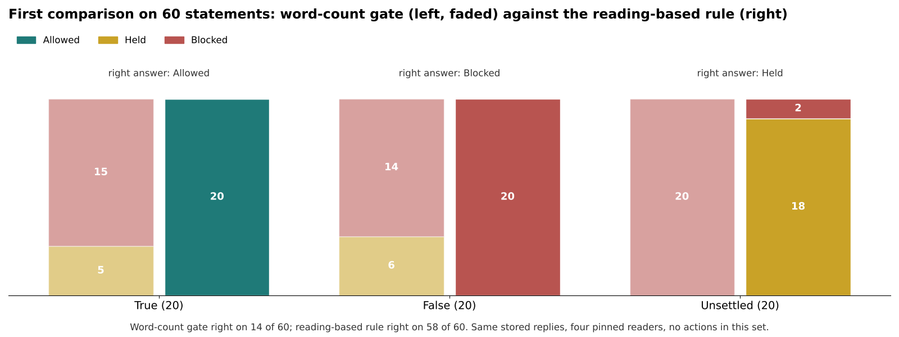

# Lane Vector and TruVector: the research in plain language

Working paper WP-03 | Michael Brandon Lane | InTellMe AI | 11 October 2026

This overview is written for a reader with no background in statistics or machine learning. It says what the research is for, how the pieces fit, what has been measured so far, and what is measured next. The formulas, the worked calculations, and the exact study configuration are in WP-01 and WP-02; the measurement plan is in the companion validation framework.

## The problem

AI systems now look things up, read what they find, and act on it: they answer a customer, place an order, write a report, or change a record. Each of those steps can go wrong in a different way. The material the system found may be one story copied fifty times. Several models may agree because they share the same blind spot. The action the system is about to take may not be the one that was actually requested.

Lane Vector is the research framework for measuring those risks. TruVector is the checkpoint that applies it, between what an AI system read and what it is about to do.

## Three questions a count cannot answer

Most systems that assess information count something: how many pages say it, how many models agree, how high a similarity score is. Lane Vector replaces the count with three questions.

**Which way does it point?** A signal has a size and a direction. A great deal of material pointing sideways can matter less than a little pointing straight at the outcome you care about. WP-01 gives the formula that measures the part of a signal that points the right way, and the conditions under which that formula is exact.

**How fast is it changing?** The change between two readings is a rate. The change in that change, which needs three readings, is acceleration. Acceleration is the earlier alarm and also the noisier one: measurement wobble is magnified by a fixed factor and divided by the square of the time between readings. WP-01 states that factor so the trade-off between an early alarm and a false one can be made deliberately.

**How many of these are really the same one?** Fifty copies of one wire story are one source, not fifty. A formula borrowed from cluster sampling says how much a pile of copies is worth once you know how alike they are, and it puts a hard ceiling on what any single origin can contribute, however many copies it sends.

## The models read; the arithmetic judges

This is the one idea the rest depends on.

Each statement is read by several language models from different families. Each reader answers three things: does the material support the statement, refute it, or leave it unsure; how confident it is; and why. A separate reading asks whether the proposed action carries out the instruction that was given.

The readers never decide. Their answers are inputs to arithmetic that lives outside any model. The arithmetic counts origins rather than replies, so two readers from one family count as a little more than one. It weighs each reply by its confidence, once that confidence has been corrected against how often the reader turns out to be right. It keeps two numbers apart: direction, which way the readers lean, and certainty, how much they agree with each other. Then it applies a rule a person can recompute by hand: Allow, Review, or Block, with every intermediate number written down.

There are three reasons for keeping the judgment outside the models. Ten runs of one model are one origin, so a decision that is only a model has one source however often it asks. The reader is what an attacker aims at, so the counting has to live where the attacker cannot reach it. And a formula can be audited and argued with; a confidence a model felt cannot.

## What a map of meaning can and cannot do

An embedding model turns a sentence into a point on a map, and nearby points are about similar things. It was natural to ask whether that map could do the reading: whether "the bridge is safe" and "the bridge is not safe" sit far enough apart to be told apart by position.

The measurement said no. Across five embedding models, a sentence and its exact opposite sat almost on top of each other, because both are about the bridge. The map is excellent at telling what a sentence is about and poor at telling which side it takes. So the map is used only for what it does well: checking that the readers were all talking about the same subject, and that a proposed action is about the instruction it is meant to carry out. Which side a sentence takes always comes from a reader that was asked.

## What has been measured so far

A first comparison took 60 statements, 20 plainly true, 20 plainly false, and 20 unsettled, and had four pinned readers read each one. The same stored replies were then scored two ways: by the earlier method, which counted how many words the readers' answers shared, and by the new rule, which uses what the readers said. The word-count method got 14 of 60 right. It allowed none of the true statements, because readers who agree in their own words share few words. The new rule got 58 of 60 right. The two it missed are unsettled statements that assert an unproven result as proven, which the readers refuted; a reader that reads them as written is right to, so those two are a question about labeling rather than about the rule.

Figure 1. Decisions on the first 60 statements under both scorings. The set was built to be easy and carries no actions; it shows that the rule works as designed, not how accurate it will be in use.

A second measurement tested the map of meaning directly, first on 30 pairs of reasons and 20 sentences paired with their exact negations, then on a larger set of 210 reason pairs and 50 negation pairs written so that shared words could not give the answer away. Under all five embedding models, both times, the map told related from unrelated almost perfectly, and a little better than simply counting shared words. No model reliably told a point from its opposite, and every model placed a sentence close to its own negation. That result changed the design: the angle between texts became a guard, and direction became a reading.

A third measurement, Study TV-001, scored the same stored replies both ways on 300 harder statements, each with a label backed by a quote from a public source: meaning-based scoring made the right decision on 282 of 300 against 101 of 300 for word overlap (exact McNemar p = 1.1e-50), neither gave Allow to any of the 180 refuted or unsettled statements, and a sentence and its exact negation received opposite decisions in 50 of 50 pairs against 0 of 50. The set was built by the same team, so the result describes that set; the full tables are in WP-04.

Those are the only numbers this paper reports.

## Planned measurements

Each planned measurement is written down with the result that would prove it wrong, so that an outcome either way is informative.

An outside benchmark. The same comparison, with the same frozen settings, is run on a public set of labelled statements assembled by other researchers. Wrong, as a general result, if meaning-based scoring does not make more right decisions than word-overlap scoring on such a set.

Negation. Readers and a plain angle threshold are compared on the same negation pairs. Wrong if the readers are no more accurate than the threshold.

Confidence. For each reader, how often a stated 90, 70, or 50 percent is right; a correction is fitted on half the labeled statements and tested on the other half. Wrong if the correction does not improve the score on the held-out half, in which case confidence is treated as noise.

Dependence between readers. How alike the answers are within one model family compared with across families. Wrong if answers within a family are no more alike than answers across families, in which case every reply counts as its own origin.

Stability across maps. The rule is run with two embedding models on the same 300 statements. Wrong if more than five percent of decisions flip.

Off-subject reasons. Statements written to tempt a reader into answering a different question. Wrong if the subject guard fires no more often on those than on ordinary statements.

Planted copies. Copies of one document planted among the retrieved material at ten, thirty, and fifty percent. Wrong if copies from one controlled origin ever lift its weight above the ceiling, or if false Allows rise.

Where to set the bars. The Allow and Block thresholds are refitted on half the labeled statements and tested on the other half. Wrong if the refitted bars mislabel more of the held-out half than a plain majority of readers does.

Lane Vector additionally tests whether a direction-weighted signal predicts outcomes better than volume alone, and whether acceleration gives earlier warning than a volume threshold at the same false-alarm rate. Those tests use observations held back from fitting and record each forecast before the next observation arrives.

## Where it applies

Three workflows draw on the same arithmetic. A retrieval gateway can use the origin weights to decide which passages reach a model and to annotate the rest. A multi-reader checkpoint can keep dissent and uncertainty visible while reducing the influence of repeated origins. An action checkpoint can compare a proposed operation with the instruction that authorized it before anything runs.

Each has its own acceptance criteria. Retrieval is judged on recovering origins correctly and on what context is actually delivered. Reader aggregation is judged on decision quality and on correlated errors. Action checking is judged on reversals and changed critical fields (recipient, amount, date, scope), alongside the application's own permissions and its resistance to adversarial input.

## What the system does not do

It does not tell whether a statement is true. It tells whether the readers' output is consistent, supported by independent origins, and on the subject asked, and it flags a reader that asserts without support, a reader whose reason is about something else, and readers who agree on the label but not on why. Whether a source is authentic, whether a reason is logically sound, and whether the whole pipeline resists a determined attacker are separate properties with their own tests.

Lane Vector supplies the research framework. TruVector supplies the checkpoint procedure. InTellMe AI is responsible for both.

## Suggested citation

Lane, M. B. (2026). Lane Vector and TruVector: the research in plain language (Working paper WP-03, revised 11 October 2026). InTellMe AI.
