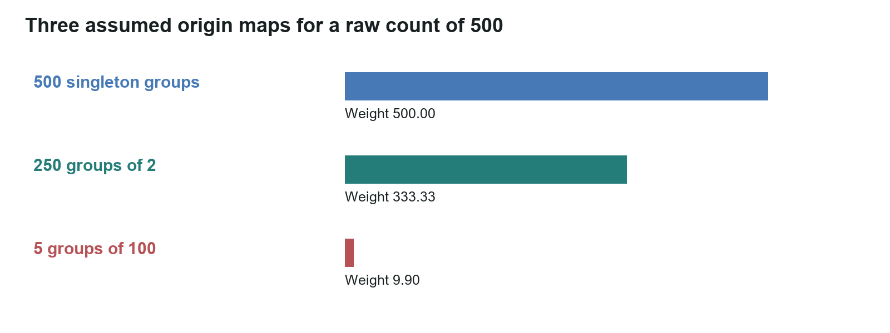

# Lane Vector and TruVector research overview

Working paper WP-03 | Michael Brandon Lane | InTellMe AI | 5 October 2026

## Research thesis

AI systems increasingly retrieve information, combine model responses, and propose actions within a single workflow. These stages create distinct assessment requirements: relevance, support or refutation, source dependence, and consistency with the authorized instruction. Lane Vector and TruVector organize these requirements into a measurable research framework and an explicit decision procedure.

Lane Vector studies information through direction relative to an outcome, change over time, and dependence among origins. TruVector applies that framework at the checkpoint between retrieved material and an AI action. Language models interpret statements and instructions; embeddings check subject relevance; arithmetic aggregates the recorded readings and returns Allow, Review, or Block.

## Architecture and differentiation

Readers classify statements as supported, refuted, or unsure, with reasons and confidence. Separate readings assess instruction consistency. The numerical layer applies source discounts and explicit decision conditions.

This separation makes decisions reconstructable. An operator can inspect the reader outputs, source assignments, effective weights, subject checks, and thresholds associated with a result. The research tests whether this combined procedure improves decision quality relative to word overlap, unweighted model majority, and retrieval deduplication.

The contribution is the integrated procedure and its evaluation. Projection, finite differences, entropy, and cluster-sampling design effects provide established mathematical foundations. Their application to reader aggregation and action assessment creates specific, testable engineering questions.

## Semantic interpretation and subject relevance

Text embeddings represent subject relationships in a numerical coordinate system. A sentence and its negation can remain close because they concern the same subject. TruVector therefore uses embedding similarity to assess relevance while reserving support, refutation, and instruction interpretation for readers.

Action assessment examines recipient, quantity, scope, conditions, and negation. Subject similarity cannot override an instruction reversal. The recorded embedding basis supports reproducible guard thresholds.

## Dependence-aware source weighting

Repeated material from a shared origin contributes less independent information than the same volume from separate origins. TruVector uses a defined group contribution:

$$n_eff = m / (1 + lambda(m - 1)).$$

Here m is group size and lambda is the declared within-group dependence parameter. For positive lambda, the contribution approaches a ceiling of 1/lambda within that group. Source recovery and parameter estimation determine whether this weighting represents the observed structure appropriately.

Document and reader origins are tracked separately, preserving source structure across multiple interpretations. This supports analysis of syndication, repeated passages, and correlated model responses.

Figure 1. Calculated contributions for three declared source structures, each with 500 observations: 500 singletons, 250 pairs, and five groups of 100. The grouped scenarios use lambda = 0.5 and yield approximately 333 and 9.9 effective weight units.

## Decision policy

Allow requires sufficient usable readings, directional support, effective source weight, passing subject guards, an acceptable action reading, and no unsupported-reader flag. Review routes unresolved conditions to an operator. Block stops execution when the defined opposition or quorum conditions apply. The decision record distinguishes substantive opposition from unavailable inputs.

Support, refutation, and uncertainty remain visible alongside direction and label concentration. Concentrated uncertainty remains uncertainty. Confidence calibration and source dependence are measured separately rather than inferred from agreement alone. Statement assessment and action authorization are also distinct: a statement-only evaluation does not measure action execution safety.

## Preliminary research results

The reported balanced comparison contains 60 statements: 20 labeled true, 20 false, and 20 unsettled. Under the original labels, the earlier word-based gate produced 14 correct decisions and the reading-based replacement produced 58. The replacement allowed the 20 true items, blocked the 20 false items, and routed 18 unsettled items to Review; two unsettled items were blocked.

Figure 2. Reported decisions under the original study labels. This preliminary statement-only comparison is a feasibility result; it does not estimate deployment accuracy or evaluate the action policy.

Two item labels remain subject to independent review because their wording describes unproven results as proven. The reported total remains 58/60. Item-level reproduction, documented label provenance, and a frozen independent evaluation set are the next milestones.

The reported embedding comparison includes 30 reason pairs and 20 negation pairs across five models. Its results support the separation of subject relevance from directional interpretation in the current architecture. Expanded testing includes varied paraphrases, critical-field changes, and specialist contradiction baselines.

## Research roadmap

The next evaluation measures subject separation, negation handling, confidence calibration, reader dependence, basis sensitivity, off-subject responses, repetition resistance, and decision thresholds. Development and evaluation data are separated; thresholds are frozen before holdout testing. Comparisons report false Allow, false Block, Review coverage, action errors, and uncertainty intervals.

Lane Vector additionally tests whether directional projections improve outcome prediction and whether acceleration improves alert lead time at matched false-alarm rates. Defined coordinates, sampling intervals, and noise models make these comparisons interpretable. Temporal methods are evaluated on future observations reserved from model fitting.

A predictive search application begins with a measured company baseline and comparable observations at defined intervals. Two observations establish change; at least three are needed for acceleration. Forecasts are recorded before the next observation and evaluated against its result and a baseline, with seasonality and intervention effects considered.

## Application pathways

The research addresses three related workflows: dependence-aware retrieval, aggregation of multiple reader responses, and instruction-consistent action assessment. A retrieval gateway can use source weights to select or annotate passages. A multi-reader checkpoint can preserve dissent and uncertainty while reducing the influence of repeated origins. An action checkpoint can compare a proposed operation with the authorized instruction before execution.

Each pathway has its own acceptance criteria. Retrieval testing measures origin recovery and delivered context. Reader aggregation measures decision quality and correlated errors. Action testing measures instruction reversals and critical-field changes, alongside application permissions and adversarial robustness. These are prospective application pathways, with validation defined at the workflow level.

Lane Vector supplies the research framework. TruVector supplies the checkpoint procedure. InTellMe AI is responsible for both. WP-01 and WP-02 provide the mathematical definitions, worked calculations, study configuration, and evaluation criteria.

## Suggested citation

Lane, M. B. (2026). Lane Vector and TruVector research overview (Working paper WP-03, revised 5 October 2026). InTellMe AI.
